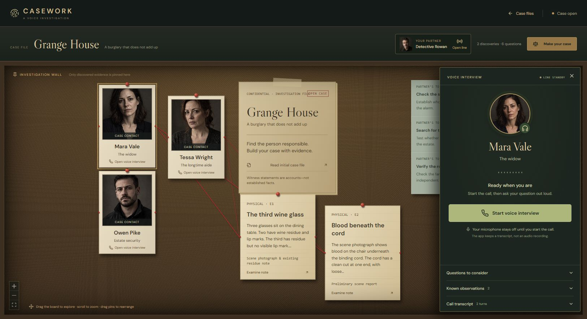
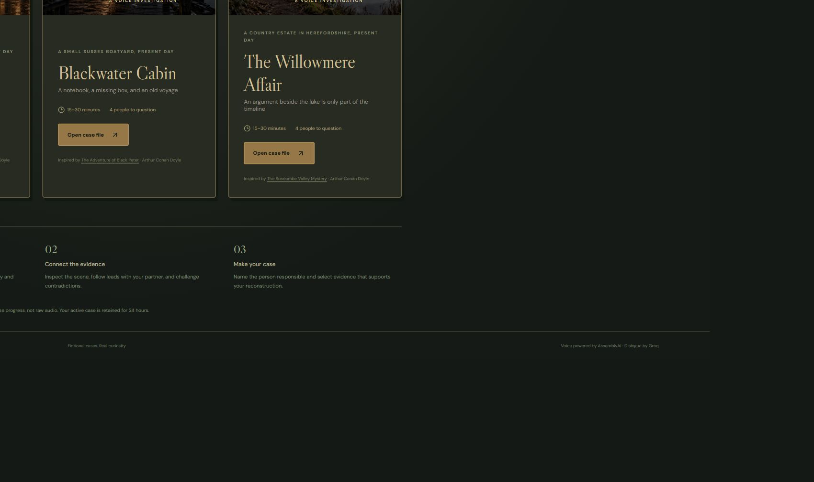
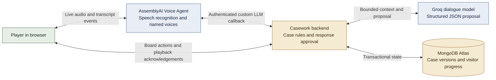

# Casework

### A voice-native detective game with an AI investigative partner

Question witnesses in their own voices. Compare their accounts with the evidence. Work with Detective Rowan, then build a supported reconstruction of what happened.

Casework turns a murder mystery into a browser investigation: a dark pinboard, fictional character portraits, spoken interviews, and discoveries that appear only as you earn them. The stories have fixed answers. AI makes the conversations flexible without deciding the truth of the case.


[Architecture guide](architecture/README.md) · [Submission materials](submission/README.md) · [Technology and safeguards](architecture/runtime.md) · [MIT license](LICENSE)

## The experience

1. Choose an investigation and read its initial case file.
2. Examine available scene evidence. Notes show observations rather than the answer.
3. Select a character and explicitly start a voice interview. Speak naturally and interrupt a reply when you need to challenge it.
4. Call Detective Rowan for a direction or an available investigation lead. The partner works from discovered information, not the hidden solution.
5. Name the person responsible and select supporting evidence. Some cases also support an earned, verified confession.

There is no typed-chat interface and no signup requirement. Each browser gets independent progress, with temporary recovery for 24 hours. The application retains interview text and progress, not raw audio recordings.

<details>
<summary>Voice interview and investigation library</summary>





</details>

## Three investigations, one engine

| Investigation | Opening question | Literary inspiration |
| --- | --- | --- |
| **Grange House** | Does the reported burglary explain the scene? | *The Adventure of the Abbey Grange* |
| **Blackwater Cabin** | What connects a missing box to an old voyage? | *The Adventure of Black Peter* |
| **The Willowmere Affair** | How much does a witnessed argument really establish? | *The Boscombe Valley Mystery* |

These are contemporary fictional adaptations of Arthur Conan Doyle stories. The gameplay target is **15–30 minutes per case**, not a measured completion-time claim. Each pack defines its own people, permitted knowledge, clues, disclosure prerequisites, investigative leads, and proof requirements. Adding a case does not require case-specific branches in the engine or UI.

Sources: [The Return of Sherlock Holmes](https://www.gutenberg.org/ebooks/108), [The Adventures of Sherlock Holmes](https://www.gutenberg.org/ebooks/1661). Portraits and location artwork depict fictional people and scenes. [Asset provenance](public/assets/ATTRIBUTION.md).

## How the AI fits



The model proposes dialogue or a reveal ID in nested JSON. The backend validates prerequisites and uses authored wording for critical revelations. The browser acknowledges actual playback before the engine commits a spoken discovery. A generated reply, or a model's `condition_reached` flag, is never enough to unlock evidence.

## Technology

| Layer | Choice and responsibility |
| --- | --- |
| Browser | React, Vite, React Flow, Lucide, Web Audio and an AudioWorklet |
| Voice | AssemblyAI Voice Agent API with distinct named character voices |
| Dialogue | Groq through a configurable OpenAI-compatible structured-output adapter |
| Backend | Node.js, Express, Zod validation, an authoritative case engine |
| Persistence | MongoDB Atlas, transactions, immutable case versions, TTL retention |
| Deployment target | Vercel static client and serverless API, with a public HTTPS voice callback |

## Run locally

Use **Node.js 22+**. Keep all credentials server-side.

```bash
npm ci
```

Copy `.env.example` to `.env`, then configure Atlas, AssemblyAI, Groq, a stable 32+ character `APP_SECRET`, and `PUBLIC_BASE_URL`. For voice, the public base URL must be the running application's HTTPS origin, not the GitHub repository or an `/api` path. A local development tunnel can provide that callback while the UI runs on localhost.

```bash
npm run seed
npm run dev
```

Open `http://localhost:4173`. Microphone access works on localhost or HTTPS. Leave `ALLOW_OFFLINE_DEMO=false` for real services. Explicit fixture mode exists for development and never silently replaces production AI or persistence.

```bash
npm test
npm run format:check
npm run build
```

Optional integration checks: `npm run test:mongodb`, `npm run test:dialogue`, and `npm run check:services`. These contact the configured services. The dialogue check uses provider credits, and the database check creates and cleans up its own synthetic visitors. [Setup and deployment details](architecture/operations.md).

## Engineering checkpoint

**55 deterministic tests pass**, covering case gates, visitor isolation, retry idempotency, API security, conservative speech acknowledgements, semantic interruptions, microphone cleanup, and voice-only UI rendering. The production build and formatting checks also pass. Separate live checks verified Atlas transactions/recovery and Groq structured proposals.

The local app uses real providers. Hosted deployment, the latest end-to-end voice fix, broad adversarial dialogue checks, and measured gameplay pacing still need final validation. Partner attention requests are currently visual; the planned short spoken alert is not yet implemented. See the [verification matrix](architecture/operations.md#verification-and-demo-scope) for precise scope.

## Repository map

```text
cases/          Authored, versioned investigations
src/            Game UI, hooks, board nodes, browser voice client
server/         Case engine, dialogue approval, persistence, security, voice service
shared/         Speech normalization and delivery helpers
api/            Serverless entry point
tests/          Deterministic tests and opt-in integrations
scripts/        Import and service checks
public/assets/  Fictional portraits and investigation artwork
architecture/   Public architecture diagrams and engineering guide
submission/     Judge-facing presentation and submission copy
```

Private development notes and the earlier protocol prototype are excluded from the current repository tree. The public case packs include solution data for code review, so reading the source can reveal spoilers. Runtime projections still keep undiscovered facts out of ordinary player payloads.
