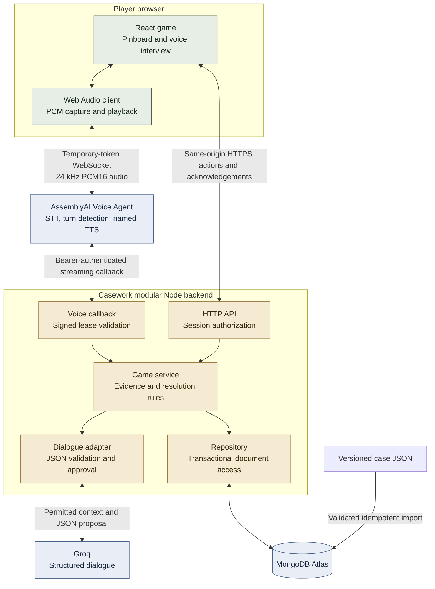
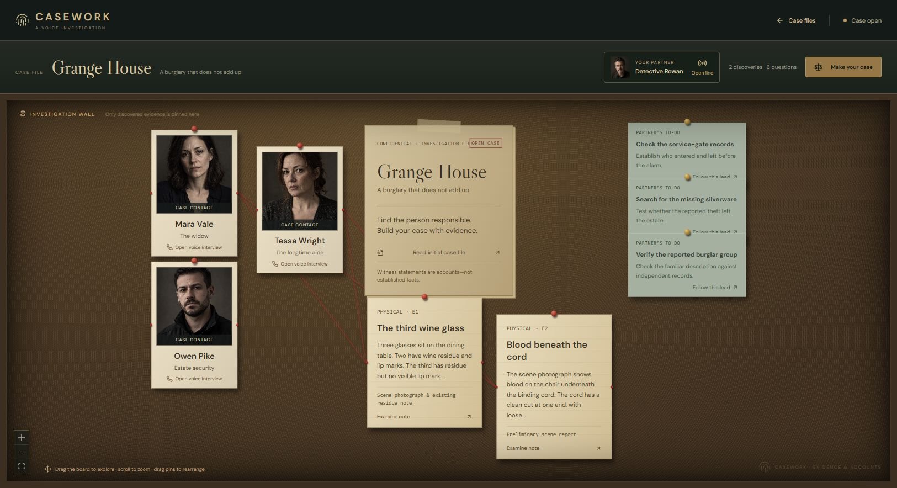

# Architecture guide

Casework is a multi-case, voice-native investigation game. This guide describes the implemented design for reviewers and contributors, not a transcript of development discussions.

## Reading map

| Document | What it explains |
| --- | --- |
| [Runtime and trust boundaries](runtime.md) | Components, responsibilities, AI authority, and external integrations |
| [Voice and discovery flow](voice-flow.md) | One spoken turn, interruption handling, and the evidence-commit boundary |
| [Data and state](data-model.md) | MongoDB collections, case versioning, state ownership, and transactions |
| [Operations and verification](operations.md) | API surface, setup, deployment target, demo limits, and verification status |
| [Design choices](decisions.md) | The main trade-offs behind the implementation |

## System overview

## Five invariants

1. **Case truth stays fixed.** AI does not choose the culprit or rewrite published case facts.
2. **The backend owns progress.** The UI and model cannot grant themselves a clue or a win.
3. **Visitors are independent.** Every turn, discovery, and voice lease belongs to a session.
4. **Delivery matters.** An approved spoken reveal does not become evidence until playback acknowledgement passes validation.
5. **Content drives the engine.** Character IDs, prerequisites, partner identity, and proof groups come from case packs rather than case-specific code.

The application uses a single modular backend, not a microservice fleet. Its modules can be tested separately while sharing one transactional persistence boundary.

The 15–30-minute case duration is a design target. The current public deployment and live-voice validation scope appear in [operations](operations.md), so diagrammed capabilities should not be mistaken for a completed production certification.
