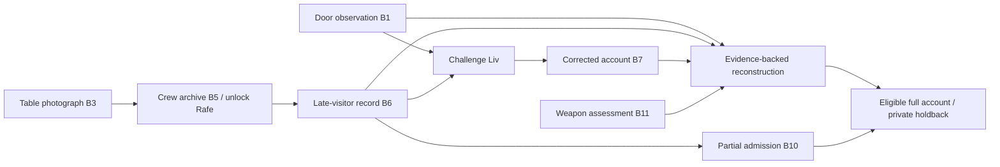

# Blackwater Cabin — case bible (spoilers)

Status: implemented as immutable `blackwater-cabin:1` in [the case pack](../../cases/blackwater-cabin.json). Runtime gates and wording in that pack are authoritative. The owner delegated two additional investigations on September 30; this uses a previously shortlisted source.

Source: Arthur Conan Doyle's [“The Adventure of Black Peter”](https://www.gutenberg.org/cache/epub/108/pg108-images.html), in *The Return of Sherlock Holmes*. Retains a misleading young visitor, maritime history, abandoned personal belongings, and a later crew member's confrontation. Names, boatyard, timings, heavy boat-hook rather than harpoon, hotel corroboration, and deliberate door damage are original contemporary adaptation details. No strength stereotype, historical whaling knowledge, or instant forensic result is necessary to solve it.

## Fixed truth and timeline

Victor Sloane's private cabin is used for meetings at a Sussex boatyard. Elias seeks information about his father's disappearance on an old salvage voyage. Rafe seeks money over Sloane's concealed misconduct on that voyage. A confrontation becomes fatal: Rafe strikes Sloane with the heavy end of a boat-hook. His defensive explanation is testimony, not an automatic legal finding. He takes the document box and damages the entry from inside afterward to imply a break-in. He forgets his pouch. Elias's earlier notebook is accidentally blood-spotted during the later incident, not evidence of his presence at the blow.

| Time | Fixed event |
| --- | --- |
| 19:10–19:36 | Elias visits, argues, and leaves his notebook on the desk. |
| 20:06–21:40 | Independent continuous hotel footage accounts for Elias. |
| 20:58 | Rafe enters for his booked meeting. |
| About 21:14 | Fatal confrontation; Liv hears the crash and looks from the stair window. |
| 21:14–21:18 | Rafe takes the box, damages the door, and leaves; Liv sees the tool and box, not the strike. |
| 21:22 | Liv calls for help after hesitating. |

The session begins the next day with collected records and a preliminary assessment available. Retrieval is bounded file review, not a laboratory processing evidence in seconds.

## Character boundaries

- Elias knows only his earlier visit and family research. His notebook account is separately corroborated; motive and argument cannot convict him.
- Liv initially conceals looking out of the window to protect her livelihood. Door observations plus the late-visitor record unlock her corrected account. She must never claim to have witnessed the blow.
- Dena knows the booking/archive/inventory; she did not witness the confrontation. Matching a pouch photograph supplies a lead, not a unique forensic identification.
- Rafe is unlocked by the crew/archive lead. Presence evidence unlocks a partial admission. His full account additionally needs the witness bridge, door observation, weapon assessment, and prior admission.
- Rowan receives only discovered observations and permitted lead descriptions; no private solution or holdback.

## Proof and disclosure graph

Every reconstruction requires **B1 + B6 + B7 + B11**. B4/B9 explain the misleading notebook; B8 supplies missing-property context. None replaces a proof link. The confession holdback is **two pieces of a pale latch wedge inside the empty kettle**, verified against a pre-existing withheld collection note. No opening, ordinary prompt, lead, or exhibit contains that detail. Partial speech cannot commit the confession.

Pacing target: 2–3 minutes briefing, 4–6 scene/records, 7–12 interviews, 2–5 reconstruction. Multiple inspection orders work; witness discovery has explicit prerequisites, not a runtime model's feeling that enough has happened. Timing still needs human voice playtesting.
