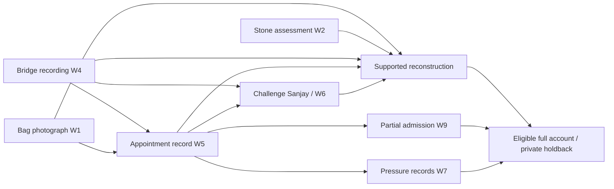

# The Willowmere Affair — case bible (spoilers)

Status: implemented as immutable `willowmere:1` in [the case pack](../../cases/willowmere.json). The pack is authoritative for gameplay. Added under the owner's September 30 request for two more investigations.

Source: Arthur Conan Doyle's [“The Boscombe Valley Mystery”](https://www.gutenberg.org/cache/epub/1661/pg1661-images.html), in *The Adventures of Sherlock Holmes*. Retains the misleading father/son argument, a separate appointment, a powerful associate under pressure, and a witness/physical trail. Modern messages, footbridge footage, cottage-transfer pressure, and deliberate planted fishing bag are original adaptation details. There is no accent-dependent dying-word riddle, period gun deduction, or secret promise to conceal a crime.

## Fixed truth and timeline

Carl Bennett pressures Gideon Ward over old financial papers and demands ownership of the cottage his family occupies. Carl also pressures Noah to influence Amelia. Noah's disagreement is genuine but not the fatal encounter. After Noah walks away, Gideon meets Carl and strikes him with a landscaping stone. He moves Noah's bag from under the bench through the blood, places the stone inside, and withdraws toward the woods. Noah returns to help his father; the resulting blood on his sleeves and earlier argument misleadingly point toward him.

| Time | Fixed event |
| --- | --- |
| Morning | Carl messages Gideon for a 16:10 lake meeting; Gideon's reply agrees. |
| About 16:04 | Sanjay sees Carl and Noah arguing but sees no blow. |
| Before 16:08 | Noah leaves his bag under the bench and walks toward the footbridge. |
| 16:08–16:12 | Continuous bridge footage shows Noah away from the lake. |
| About 16:10–16:11 | Gideon meets Carl; the fatal strike and bag movement occur. Sanjay sees the later arrival and aftermath, not the strike. |
| 16:12–16:15 | Noah returns at a cry, attempts aid, and calls emergency services. |

The next-day review has existing scene photographs, a preliminary medical note, authorized phone extraction, camera footage, and estate records. Clues use their actual limits: compatible injury shape is not unique weapon attribution, tracks are not a biometric identity, and appointment messages are not proof that a meeting occurred.

## Character boundaries

- Noah gives the departure/return account and initially protects the private disagreement. Bag observations unlock his fuller account; his claims are labeled testimony.
- Amelia knows the relationship pressure, not the killing. Noah's disclosed disagreement unlocks her contextual account.
- Sanjay initially hides staying near the lake because Gideon employs him. Independent timing plus the separate appointment allow a corrected sighting. He never claims he saw the blow.
- Gideon starts accessible, unlike the late-unlocked suspect in Blackwater. Messages unlock partial admission; the full account requires the scene, witness, documentary pressure, and prior admission.
- Rowan uses discovered observations only. General help does not automatically perform an investigation or reveal the ending.

## Proof and disclosure graph

Reconstruction requires **W1 + W2 + W4 + W5 + W6**: bag movement, plausible tool, independent interval, a separate appointment, and corrected later sighting. Relationship context, money, a stick, and guilt alone cannot substitute. Confession additionally requires W7 and W9. Its holdback is **the orange rain cover folded around the stone with its torn corner inward**, checked against the withheld original collection note. Publicly released photographs/inventory omit that collection detail.

Pacing target: 2–3 minutes briefing, 4–6 scene/records, 7–12 interviews, 2–5 confrontation/reconstruction. All four people are initially available, permitting different interview orders. This is designed for 15–30 minutes, not yet human-playtested.
