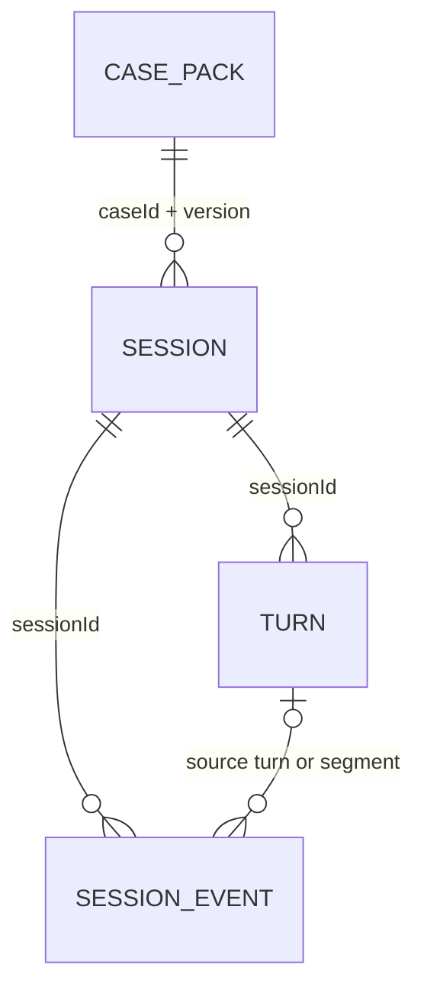

# Data model (working draft)

MongoDB Atlas is selected for first-release persistence. The proposed collection boundaries below are **not yet approved**. No admin panel and no raw-audio archive are required. The backend is the only database client; it exposes only player-visible projections.

## Proposed collections

| Collection | Document boundary and important fields | Purpose |
| --- | --- | --- |
| `case_packs` | One immutable document per `caseId` + `version`: public metadata, briefing, canonical truth, characters and their knowledge, evidence, disclosure rules, proof/confession rules, `schemaVersion` | Runtime case definition. Private fields never go directly to the browser or unrestricted dialogue model. Case source may be authored as versioned files and imported after validation; this workflow is open. |
| `sessions` | One document per active visitor: opaque `sessionId`, `caseId`, `caseVersion`, status, selected character, discovered evidence/claims, character disclosure levels, lead state, state revision, timestamps, `expiresAt` | Small current-state snapshot for fast resume and rule checks. Do not copy the entire case or full conversation into it. |
| `turns` | One document per player/character exchange: `sessionId`, ordered `turnNo`, character ID, player transcript, backend-approved reply, short speech segments and their delivery/acknowledgement states, timestamps, `expiresAt` | Text dialogue history and the link between spoken segments and candidate reveals. No raw microphone/synthesized audio, rejected model text, or full prompt log by default. |
| `session_events` | One document per committed game event: `sessionId`, ordered event ID, type, source turn/segment or UI action, affected fact/claim/lead ID, timestamp, `expiresAt` | Traceable evidence discovery, character-state changes, partner findings, and accusation attempts. Helps explain why a board fact is present and rebuild state if needed. |



The ER diagram shows logical references, not SQL joins. A prepared case is read together and changes rarely, so embedding its related characters, clues, and rules in one versioned document is a reasonable starting point. Conversation turns and events grow during play, so they remain separate from the session snapshot. MongoDB documents have a [16 MiB limit](https://www.mongodb.com/docs/manual/data-modeling/embedding/); case-pack validation should check actual size. [Embedding versus references](https://www.mongodb.com/docs/manual/data-modeling/schema-design-process/map-relationships/) is chosen by read/write pattern, not by whether a field is conceptually a separate entity.

## Illustrative documents

These examples are deliberately small and use the unapproved Grange House draft. They show storage boundaries, **not** final field names, dialogue JSON, reveal predicates, or approved case prose.

### `case_packs`: one shared, immutable case version

```json
{
  "_id": "grange-house:v1",
  "caseId": "grange-house",
  "version": 1,
  "schemaVersion": 1,
  "status": "published",
  "public": {
    "title": "Grange House",
    "briefing": "Elliot Vale was found dead at his estate...",
    "initialCharacterIds": ["mara", "tessa", "owen"]
  },
  "private": {
    "truth": { "fatalActorId": "jack", "stagingKind": "false_burglary" },
    "characters": [
      {
        "id": "tessa",
        "knowledgeFactIds": ["jack_at_scene", "staging_help"],
        "revealIds": ["tessa_corrected_timeline"]
      }
    ],
    "evidence": [
      { "id": "E2", "boardText": "Mara was tied after the fatal injury" }
    ],
    "reveals": [
      {
        "id": "tessa_corrected_timeline",
        "characterId": "tessa",
        "level": "partial",
        "requires": { "anyEvidenceIds": ["E2", "E3"] },
        "approvedSpeech": "I arrived just after the blow and saw Jack holding the fireplace tool.",
        "commitsClaimId": "E8"
      }
    ],
    "resolution": {
      "fatalActorId": "jack",
      "proof": { "stagingAny": ["E2", "E3"], "presence": "E4", "aftermath": "E8" }
    }
  }
}
```

The case pack is stored **once**, not copied for every player. The browser receives a filtered `public` projection plus only facts the visitor has discovered. The backend also filters `private` before building an LLM prompt: a suspect is never handed the entire canonical truth or the locked wording of a reveal. Updates create `v2`; existing sessions stay pinned to `v1` until they end. Whether version-controlled case files are imported into Atlas at deployment is still a choice to confirm.

### `sessions`: one small state snapshot per visitor

```json
{
  "_id": "sess_7f3...",
  "caseRef": { "caseId": "grange-house", "version": 1 },
  "status": "active",
  "selectedCharacterId": "tessa",
  "knownEvidenceIds": ["E2"],
  "heardClaimIds": [],
  "unlockedCharacterIds": ["mara", "tessa", "owen"],
  "characterState": {
    "tessa": { "disclosureLevel": "denial", "revealedIds": [] }
  },
  "leadState": { "pondSearch": "not_started" },
  "revision": 6,
  "createdAt": "2026-09-26T12:00:00Z",
  "lastActiveAt": "2026-09-26T12:10:00Z",
  "expiresAt": "2026-09-27T12:00:00Z"
}
```

This is the game engine's fast current view, not an authorization token and not a transcript. `revision` is a proposed guard against stale concurrent updates. The temporary browser credential and its server-side validation are a separate security design. The fixed 24-hour expiry shown is only an example; a sliding recovery window would require coordinated retention updates.

### `turns`: one text exchange, possibly interrupted

```json
{
  "_id": "turn_12",
  "sessionId": "sess_7f3...",
  "turnNo": 12,
  "characterId": "tessa",
  "playerTranscript": "The chair evidence says Mara was tied afterward. When did you enter?",
  "approvedReply": {
    "text": "I was there earlier than I said. I saw Jack beside Elliot.",
    "segments": [
      { "id": "12-1", "text": "I was there earlier than I said.", "playback": "heard" },
      { "id": "12-2", "text": "I saw Jack beside Elliot.", "candidateClaimId": "E8", "playback": "pending" }
    ]
  },
  "status": "partially_heard",
  "createdAt": "2026-09-26T12:10:00Z",
  "expiresAt": "2026-09-27T12:00:00Z"
}
```

The transcript is inserted before the model call. The approved reply is written before it is spoken. `candidateClaimId` is server-side metadata, not a discovered board item: in this example, interruption before segment `12-2` finishes leaves `E8` undiscovered. We do not store raw microphone audio, synthesized audio, unapproved model text, or full prompts by default. Exact alignment of approved segments with AssemblyAI playback is an integration test still to pass.

### `session_events`: one committed change with provenance

```json
{
  "_id": "event_37",
  "sessionId": "sess_7f3...",
  "eventNo": 37,
  "type": "claim_heard",
  "claimId": "E8",
  "source": { "kind": "spoken_segment", "turnId": "turn_12", "segmentId": "12-2" },
  "occurredAt": "2026-09-26T12:10:23Z",
  "expiresAt": "2026-09-27T12:00:00Z"
}
```

This event illustrates the later state **after** segment `12-2` is heard; the turn example above illustrates the earlier interrupted state, so they are not simultaneous snapshots. Other event types could record inspected evidence, a partner investigation result, or an accusation. This is why a board card can identify its source. The event collection is proposed rather than approved; the simpler alternative is `sessions` plus `turns`, with less auditability. A state change and its provenance event must not diverge; the exact atomic-write/idempotency mechanism will be chosen during implementation.

## Required write order and invariants

1. Save the recognized player transcript to a turn before invoking the dialogue model.
2. Assemble model context from the pinned case version, authoritative session state, and relevant prior turns; do not blindly replay an ever-growing transcript.
3. Save only the backend-approved spoken reply and any candidate reveal/segment mapping before returning speech to AssemblyAI.
4. A reveal becomes discovered only after a valid playback acknowledgement; then record the event and update the session snapshot idempotently. An interrupted or stale turn must not commit an unheard clue.
5. Every API read/write is scoped to the authenticated temporary session. The browser never queries Atlas directly or receives canonical truth.

Proposed indexes: unique `(caseId, version)` on case packs; unique `(sessionId, turnNo)` on turns; unique `(sessionId, eventNo)` on events; session `_id` is already indexed. Expiring sessions, turns, and events may each have an `expiresAt` [TTL index](https://www.mongodb.com/docs/manual/core/index-ttl/). TTL deletion is asynchronous, so the backend must reject expired sessions itself. Case import must validate the document shape and all cross-referenced IDs before publication. Exact retention, atomic update/retry strategy, and token design remain open.

## Questions to settle

1. Should Atlas hold the private case packs at runtime, with version-controlled authoring files imported at deployment, or should case packs remain runtime files while only visitor data lives in Atlas?
2. How long should an active session remain recoverable after the visitor leaves? A 24-hour window is a proposal, not a decision.
3. Do we need the separate `session_events` collection from day one, or can we start with turns plus a session snapshot and add a durable event trail after the first playable slice?
