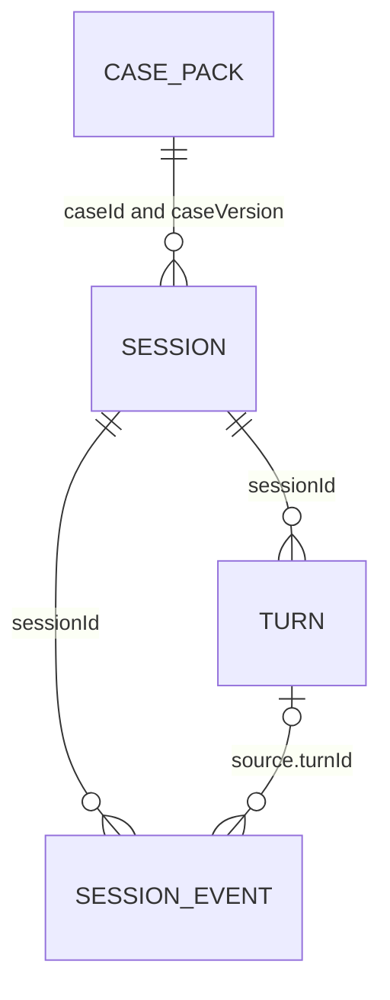

# Data architecture — implemented baseline

MongoDB Atlas is the selected production store. The isolated `Casework` project and free `casework-demo` cluster are connected locally. The live integration test verifies initialization, real transaction commit/rollback, independent visitor state, approved/heard turn persistence, and recovery through a fresh client/API instance. Browser refresh and concurrent visitors on the public deployment remain verification gates; see [deployment.md](deployment.md).

## Collections

| Collection | Boundary | Important fields and indexes |
| --- | --- | --- |
| `case_packs` | One immutable, shared case version | `_id: id:version`, `id`, `version`, `schemaVersion`, authored pack, `contentHash`, `publishedAt`; unique `(id, version)` |
| `sessions` | One anonymous visitor's current investigation | `_id`, `caseId`, `caseVersion`, `state`, `revision`, `turnCount`, `turnLock`, `activeVoice`, `voiceSeconds`, timestamps, `expiresAt` |
| `turns` | One player/character exchange | `_id: sessionId:requestId`, `sessionId`, `turnNo`, `characterId`, `channel`, `voiceLeaseId`, `playerTranscript`, `approvedReply`, private `candidate`, `heardText`, `status`, `modelMode`, timestamps; unique `(sessionId, turnNo)` |
| `session_events` | One sourced committed discovery or accusation attempt | `_id`, `sessionId`, `type`, `clueId` or accusation fields, `source`, `occurredAt`, `expiresAt`; index `(sessionId, occurredAt)` |
| `limits` | Shared demo admission and voice-slot counters | Daily session count or numbered voice slot with owner lease ID and `expiresAt` |

Sessions, turns, events, and limit records have TTL indexes on `expiresAt`. Backend expiry checks remain mandatory because TTL cleanup is asynchronous. Default session retention is a fixed 24 hours, not a sliding window.



These are logical references, not SQL joins. A case's characters, clues, and rules are embedded in a single pack; unbounded transcript/event growth is kept outside the small session snapshot.

## Case definition versus visitor state

Validated authoring files in `cases/*.json` are automatically discovered and imported into Atlas. Import is idempotent for matching content, but rejects changes to an already-published version. New content needs a version bump; existing sessions keep their pinned version.

A pack contains both presentation material and private resolution/reveal rules. Privacy is enforced by server allowlist projections, not by merely naming a JSON field `private`. The browser receives safe metadata, unlocked people, discovered observations, neutral labels for unexamined exhibits, and permitted lead descriptions. It never imports the pack or reads Atlas directly.

The state snapshot contains `knownClueIds`, `revealedIds`, `unlockedCharacterIds`, highest heard `characterLevels`, `completedLeadIds`, `selectedCharacterId`, status, optional resolution, and partner alert. The partner ID is supplied by the case; no particular character name or clue ID is built into the engine.

## Exchange shape

```json
{
  "_id": "visitor-id:request-id",
  "sessionId": "visitor-id",
  "turnNo": 12,
  "characterId": "witness-id",
  "channel": "voice",
  "voiceLeaseId": "temporary-lease-id",
  "playerTranscript": "When did you arrive?",
  "approvedReply": {
    "text": "I arrived earlier than I said. I saw the aftermath.",
    "segments": [
      { "id": "visitor-id:request-id:0", "text": "I arrived earlier than I said.", "heard": true },
      { "id": "visitor-id:request-id:1", "text": "I saw the aftermath.", "heard": false }
    ]
  },
  "heardText": "I arrived earlier than I said.",
  "status": "interrupted"
}
```

The browser projection does not include the private candidate reveal/lead metadata. Raw microphone audio, synthesized audio, rejected model output, and prompt logs are not archived by the application.

## Write order and concurrency

1. Transactionally insert the transcript and acquire a bounded turn lock before calling the model.
2. Outside the transaction, build case-scoped context and request one structured proposal.
3. Validate the proposal and persist the approved response before returning text or streaming speech.
4. Validate delivery acknowledgements against whole approved sentence prefixes. The current conservative implementation commits a critical reveal only after the entire short approved reply is heard; partial delivery is stored without unlocking its clues.
5. Transactionally update heard state, discovery events, disclosure levels, and session snapshot. Repeat acknowledgements and turn request IDs are idempotent.

MongoDB transactions coordinate cross-document changes; the memory test repository uses a per-session queue. Transactions do not include network/model calls. Voice callback bindings are HMAC-signed and checked against the active lease and selected character, including retries.

The agreed finer-grained clue-bearing-sentence commitment remains a future refinement. The browser's actual word/audio alignment, broader contention/failure testing, and public deployment remain live-test gates. Two concurrent Atlas visitor admissions and transaction rollback have passed. Board pin positions are optional local presentation state in localStorage; they are not game progress or evidence.

See [implementation-status.md](implementation-status.md) for limits, remaining gates, and restart instructions.
