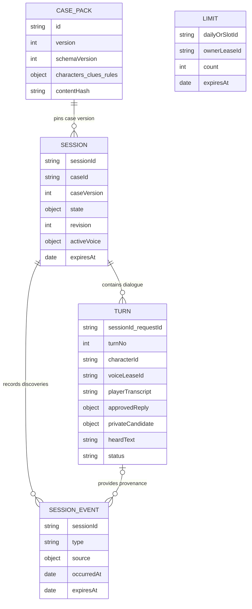
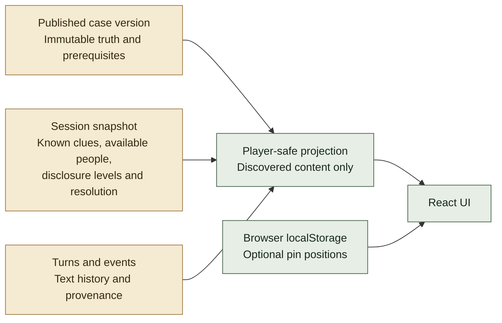

# Data and state

## Collection boundaries

The diagram shows logical document relationships, not SQL constraints. `limits` admission/voice ownership is logical: there is no database foreign-key relationship. Actual collection names are `case_packs`, `sessions`, `turns`, `session_events`, and `limits`.

| Collection | Design reason |
| --- | --- |
| `case_packs` | Shared immutable story versions embed bounded characters, observations, reveal rules, and proof groups |
| `sessions` | A small per-visitor progress snapshot avoids rereading the entire transcript for every action |
| `turns` | Dialogue grows separately from the session snapshot and preserves approved versus heard text |
| `session_events` | Source-linked discoveries and accusation attempts support provenance and auditability |
| `limits` | Shared counters and leased slots work across backend instances rather than process-local memory |

## State ownership

The backend tracks `knownClueIds`, `revealedIds`, `unlockedCharacterIds`, heard `characterLevels`, `completedLeadIds`, selected character, status, and optional resolution. Local pin positions are presentation only. Moving a note never creates evidence.

## Persistence guarantees

- Case files are automatically discovered from `cases/*.json`, validated, and imported idempotently. Changing an already-published version is rejected; a new version preserves existing sessions' pinned content.
- Turn request IDs and acknowledgements are idempotent. A unique `(sessionId, turnNo)` index protects turn numbering.
- Transactions coordinate session snapshots, turn changes, and discovery events. The model request never holds a transaction open.
- Sessions, turns, events, and limit documents have TTL indexes. The application also checks expiry because TTL removal is asynchronous.
- Anonymous recovery lasts a fixed **24 hours**. Long-term accounts, cross-device saves, and multiplayer are outside the current scope.
- MongoDB stores text/progress, not microphone or synthesized audio. Provider processing/retention policies remain separate from what this application stores.

The opt-in Atlas test verifies real transaction commit/rollback, two isolated synthetic visitors, persisted approved/heard turns, and signed-cookie recovery through a fresh client/API instance. It does not establish public load capacity or exact TTL deletion timing.

Source: [`server/store.mjs`](../server/store.mjs), [`server/game.mjs`](../server/game.mjs), [`server/cases.mjs`](../server/cases.mjs), [`tests/integration/mongodb.test.mjs`](../tests/integration/mongodb.test.mjs).
