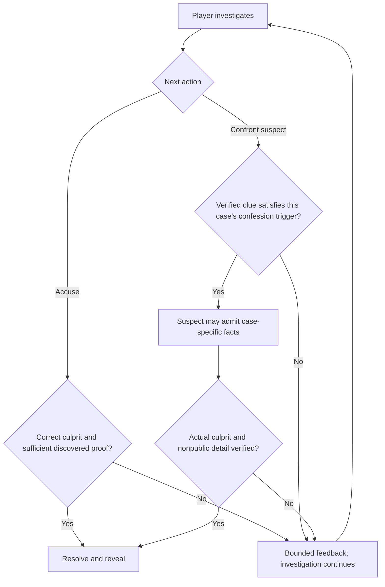

# Important flows

## Case resolution

Two accepted routes can resolve a case. Both are evaluated against the frozen case definition. A case may omit the confession route.



The dialogue model cannot authorize a confession or decide a win. The case engine controls confession eligibility and validates the admission. An interrupted admission counts only if every qualifying, clue-bearing segment finished playing to the player.

## Start or resume a case (proposed persistence flow)

```mermaid
sequenceDiagram
    autonumber
    participant P as Player
    participant UI as Browser
    participant G as Game backend
    participant DB as MongoDB Atlas
    P->>UI: Select Grange House
    UI->>G: Start case(caseId)
    G->>DB: Read published case pack and version
    DB-->>G: Public opening plus private rules
    G->>DB: Create visitor session pinned to case version
    G-->>UI: Temporary session credential and player-visible projection
    UI-->>P: Show briefing, known facts, available characters
    opt Refresh or brief disconnect
        UI->>G: Resume with temporary credential
        G->>DB: Validate unexpired session; read state and relevant turns
        G-->>UI: Reconstructed player-visible board and interview state
    end
```

The temporary credential is not merely a guessable session ID. Its exact cookie/token design and session lifetime remain open. Case-pack storage in Atlas is the proposed runtime model, not yet approved.

## Spoken clue and player barge-in (working flow)

The backend treats a short spoken segment as the commitment unit. With the selected Voice Agent API, AssemblyAI returns audio and transcript events, including an interrupted transcript. The browser must still verify actual playback completion before acknowledging a clue to the backend. Mapping the backend's generated text and clue candidate to AssemblyAI reply/word events is an unresolved implementation test; this diagram is the intended behavior, not a proven integration.

```mermaid
sequenceDiagram
    autonumber
    participant P as Player
    participant UI as Browser
    participant V as AssemblyAI Voice Agent
    participant G as Game backend / custom LLM endpoint
    participant DB as MongoDB Atlas
    participant L as Dialogue model
    P->>UI: Ask selected character
    UI->>V: Stream microphone audio
    V->>G: Chat-completion request with transcript and voice-session binding
    G->>DB: Validate session and selected character
    G->>DB: Insert player transcript as pending turn
    G->>DB: Read pinned case, current state, relevant earlier turns
    G->>L: Permitted context and trigger IDs
    L-->>G: Structured JSON dialogue or reveal proposal
    G->>G: Parse JSON and approve or reject reveal under case rules
    G->>DB: Save approved reply and candidate speech segments
    G-->>V: Stream approved plain speech text
    V-->>UI: Audio and aligned agent transcript events
    UI-->>P: Play segment
    alt Segment finishes
        UI->>G: Heard-speech acknowledgement (turn / segment reference)
        G->>G: Validate mapping and idempotency
        G->>DB: Mark heard; commit permitted clue, event, and state
        G-->>UI: Updated board projection
    else Player barges in
        P->>UI: Speak during playback
        V-->>UI: Interrupted reply status and trimmed transcript
        UI->>UI: Stop queued audio
        UI->>G: Interrupted/partial-heard acknowledgement
        G->>DB: Record interruption; leave incomplete segment uncommitted
    end
```

The transcript write precedes the LLM call, so an LLM failure does not erase what the player said. The approved response write precedes speech. The browser never sends raw audio to MongoDB; it streams audio to AssemblyAI. A later turn uses current structured game state and relevant prior text, not the whole database or private case truth. Voice-session binding, actual sentence playback alignment, and cross-document consistency are implementation gates, not proven behavior of the prototype.

### September 30 client safeguards

Call startup now probes public callback health without credentials before creating a provider agent. After `reply.started`, the browser waits at most 30 seconds for playable audio; a stall shows an error and ends the call through the voice hook rather than remaining indefinitely in “Considering your question.” The watchdog is cancelled on audio, barge-in, or call closure. A normal `reply.done` may omit `reply_id`, so completion is associated with the active reply; acknowledgement still waits for queued local audio to drain. Text arriving without any playable audio is not acknowledged as heard. These payload choices follow the [AssemblyAI event reference](https://www.assemblyai.com/docs/voice-agents/voice-agent-api/events-reference).

Voice captions and audio chunks do not rebuild the evidence graph. The board is memoized behind stable action callbacks, and equal/older session revisions are ignored. New authoritative discoveries still update the board; dragging and viewport movement remain presentation state.
