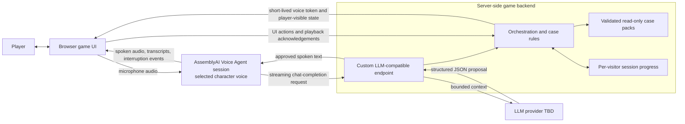

# High-level design (working draft)

This is the working first-release design after a successful two-character AssemblyAI Voice Agent API smoke test. It is not a final deployment design. The backend owns canonical case facts, evidence unlocks, and resolution checks. It isolates one active case per visitor and permits several independent visitors. Session storage, detailed API contracts, model provider, and heard-clue acknowledgement remain open.

All selected services must operate within free tiers or already-granted credits for the first release; public-link usage needs explicit caps or graceful capacity handling.

The browser receives only player-visible information and a projection of progress. The backend checks evidence unlocks and resolution against private case facts. Ordinary dialogue uses a self-checking prompt and only the character's currently permitted disclosure context, without a second LLM review call on every turn. Critical evidence, culprit, confession, and solution revelations require backend gates and may use authored wording. Prompts cannot guarantee the truth of every free-form sentence; character-context construction and high-risk response tests still need design.

An active session must be recoverable after a browser refresh or brief disconnect. The client will retain a temporary session identity and reload the player-visible projection from the backend. Sessions must be isolated by visitor; a shared global game object is not acceptable. The retention window and storage mechanism are not selected yet. Long-term saved games remain out of scope.

## Agreed player interaction

The browser presents a persistent case board with discovered facts and a side list of characters. Selecting a character opens a one-to-one voice interview and shows a character-specific view of facts the player has discovered about them. The detective appears in that list and may send a visible request to talk while another interview is active. A short alert in its own voice plays at the next quiet moment; the player decides whether to switch. The detective does not preempt the player's speech or a suspect's sentence. The player may, however, barge in and stop a suspect's reply.

The [Voice Agent API](https://www.assemblyai.com/docs/voice-agents/voice-agent-api) is the selected first-release speech path. Its [output voice is fixed per session](https://www.assemblyai.com/docs/voice-agents/voice-agent-api/session-configuration), so switching characters starts a new selected-character session. The owner reports that switching and interruption felt acceptable in the live prototype. The dashboard attributed $0.08285 of test usage to Voice Agent against a stated $150 allowance; public-demo caps still need design.

AssemblyAI's [custom-LLM connection](https://www.assemblyai.com/docs/voice-agents/voice-agent-api/connect-your-own-llm) lets a public HTTPS streaming backend endpoint produce case-bounded replies while AssemblyAI handles STT, named speech, and interruption. The live prototype validates the protocol with fixed test replies. It does not yet prove that a real model stays within a character's knowledge or that generated speech can be safely tied to evidence unlocks. The earlier modular STT/LLM/TTS approach remains a fallback.

The backend asks its chosen model for structured JSON: ordinary dialogue or a proposed reveal ID. It parses that response, checks any reveal against case rules, and then streams only approved spoken text to AssemblyAI's OpenAI-compatible completion endpoint. This is one model call, not a second LLM review. Because the backend must parse the JSON before speaking, there may be a short added pause; the real-model slice must measure it. The [draft contract](dialogue-contract.md) records the current proposal without freezing field names yet.

A narrow [two-character protocol prototype](../prototype/voice-agent/README.md) implements that candidate with fixed test replies. Its local tests pass, and the owner reports the live connection works. It deliberately does not call a live LLM or implement the case engine. Passing the protocol test does not validate free-form factual consistency or the first case's evidence rules.
