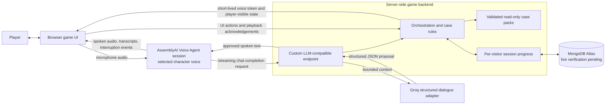

# High-level design (working draft)

This is the working first-release design. September 30 implementation uses React/Vite, a modular Node/Express API targeting Vercel, MongoDB Atlas persistence, Groq structured dialogue, and AssemblyAI named-voice sessions. The backend owns canonical case facts, evidence unlocks, and resolution checks. The browser presents a dark, draggable investigation pinboard with fictional portrait photos and an interview drawer. One visitor's progress never controls another's. Deployment, real Atlas transactions, and integrated voice delivery remain verification gates; see [implementation-status.md](implementation-status.md) for the authoritative checkpoint. Older prototype descriptions below are design history, not claims of completed integration.

All selected services must operate within free tiers or already-granted credits for the first release; public-link usage needs explicit caps or graceful capacity handling.

The browser receives only player-visible information and a projection of progress. The backend checks evidence unlocks and resolution against private case facts. Ordinary dialogue uses a self-checking prompt and only the character's currently permitted disclosure context, without a second LLM review call on every turn. Critical evidence, culprit, confession, and solution revelations require backend gates and authored wording. Prompts cannot guarantee the truth of every free-form sentence; broader adversarial and consistency playtests remain necessary.

An active session is recoverable after refresh through a signed HttpOnly cookie and a MongoDB projection, with a fixed 24-hour expiry. The repository implementation is tested against an injected memory store; real Atlas verification is pending. A shared global game object is not acceptable in production. Long-term saved games remain out of scope.

## Agreed player interaction

The browser presents a persistent case board with discovered facts and a side list of characters. Selecting a character opens a one-to-one voice interview and shows a character-specific view of facts the player has discovered about them. The detective appears in that list and may send a visible request to talk while another interview is active. A short alert in its own voice plays at the next quiet moment; the player decides whether to switch. The detective does not preempt the player's speech or a suspect's sentence. The player may, however, barge in and stop a suspect's reply.

The [Voice Agent API](https://www.assemblyai.com/docs/voice-agents/voice-agent-api) is the selected first-release speech path. Its [output voice is fixed per session](https://www.assemblyai.com/docs/voice-agents/voice-agent-api/session-configuration), so switching characters starts a new selected-character session. The owner reports that switching and interruption felt acceptable in the live prototype. The dashboard attributed $0.08285 of test usage to Voice Agent against a stated $150 allowance; public-demo caps still need design.

AssemblyAI's [custom-LLM connection](https://www.assemblyai.com/docs/voice-agents/voice-agent-api/connect-your-own-llm) lets a public HTTPS streaming backend endpoint produce case-bounded replies while AssemblyAI handles STT, named speech, and interruption. The live prototype validates the protocol with fixed test replies. It does not yet prove that a real model stays within a character's knowledge or that generated speech can be safely tied to evidence unlocks. The earlier modular STT/LLM/TTS approach remains a fallback.

The backend asks its chosen model for structured JSON: ordinary dialogue or a proposed reveal ID. It parses that response, checks any reveal against case rules, and then streams only approved spoken text to AssemblyAI's OpenAI-compatible completion endpoint. This is one model call, not a second LLM review. Because the backend must parse the JSON before speaking, there may be a short added pause; integrated voice tests must measure it. The [dialogue contract](dialogue-contract.md) records the proposal and its nested condition fields; the implemented schema is in `server/dialogue.mjs`.

A narrow [two-character protocol prototype](../prototype/voice-agent/README.md) implements that candidate with fixed test replies. Its local tests pass, and the owner reports the live connection works. It deliberately does not call a live LLM or implement the case engine. Passing the protocol test does not validate free-form factual consistency or the first case's evidence rules.
