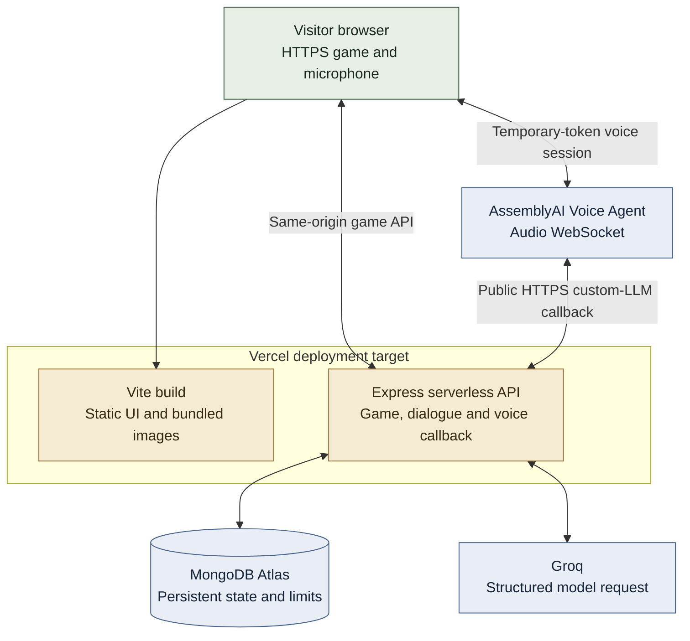

# Operations and verification

## Deployment target

`vercel.json` and `api/index.mjs` define the deployment path. **A public Vercel deployment has not yet been verified.** The local app currently uses real Atlas/provider configuration and a temporary public voice callback. A development tunnel is not the final hosted application URL.

## Environment and release checklist

Use `.env.example` as the field list. Put database/provider credentials and a stable 32+ character signing secret in server-side configuration, never the browser bundle or Git. `PUBLIC_BASE_URL` must be the application HTTPS origin without a path. The backend checks callback health before creating an agent.

For public release:

1. Configure Atlas connectivity for the deployment's actual egress, with intentionally scoped network access and database-specific privileges.
2. Set `MONGODB_URI`, `MONGODB_DB`, `APP_SECRET`, `LLM_API_KEY`, `LLM_BASE_URL`, `LLM_MODEL`, `ASSEMBLYAI_API_KEY`, and the final `PUBLIC_BASE_URL`.
3. Import the published packs, build the client, and verify the health/catalog routes.
4. Test real microphone permission, voice callback authentication, character switching, player interruption, and spoken-discovery alignment on the deployed origin.
5. Test separate browser visitors, refresh recovery, and capacity errors. Confirm the provider-credit balance separately.

The configured dialogue model is replaceable via environment variables. The committed example currently selects `qwen/qwen3.8-27b`; the architecture depends on the structured-output contract rather than a particular model's identity or advertised price.

## Communication surface

| Route | Purpose |
| --- | --- |
| `GET /api/health`, `GET /api/cases` | Service configuration presence and public catalog |
| `POST /api/session`, `GET /api/game` | Start/recover a visitor investigation and safe projection |
| `POST /api/select`, `/api/inspect`, `/api/investigate` | Select a person, inspect an exhibit, execute an available lead |
| `POST /api/accuse` | Check culprit and selected discovered proof |
| `POST /api/voice/start`, `/api/voice/stop` | Create/end the selected-character voice lease |
| `POST /api/voice/:binding/v1/chat/completions` | Authenticated custom-LLM callback with an SSE response |
| `POST /api/ack` | Validate heard text and commit an eligible discovery |
| `POST /api/alert-seen` | Acknowledge the partner's attention request |

`POST /api/turn` remains a diagnostic/test text route. The player UI does not expose typed chat. Audio travels directly between the browser and AssemblyAI, not through a Vercel audio relay.

## Demo limits and reliability

Defaults are **20 new sessions/day**, **5 simultaneous voice leases**, and **100 turns/session**. Each call lasts at most ten minutes, with a cumulative thirty-minute voice allowance per investigation. Expiring leased slots, idempotent requests, bounded model/provider calls, and transactional commits keep retries and abandoned calls from becoming shared progress corruption.

Limits are explicit demo-budget controls, not measured capacity claims. A cached MongoClient with a small pool reduces per-request connection setup. The server persists state in Atlas rather than depending on a particular function instance. Public contention/load tests and telemetry are future hardening work.

## Verification and demo scope

| Area | Evidence | Remaining check |
| --- | --- | --- |
| Case engine and isolation | 55 deterministic tests across rules, API, dialogue, UI and voice client | Human case difficulty/pacing |
| Code/build quality | Formatting and production build pass | Target-browser accessibility/performance review |
| Atlas | Live transactions, rollback, isolation, and fresh-client recovery test | Public-deployment concurrency and real browser refresh |
| Groq | Real structured-output and disclosure-trigger checks | Broad paraphrase, contradiction and prompt-injection playtests |
| Voice | Earlier owner calls and provider metadata, plus mocked protocol/playback tests | Live retest of the latest interruption/capture fixes |
| Detective partner | Separate callable partner, available leads, visual attention request | Short spoken attention alert |
| Hosting | Vercel entry point and rewrite configuration committed | Final public URL and hosted voice verification |

Routine tests do not contact AI providers. `test:dialogue` consumes a small number of real model requests; `test:mongodb` creates only its own synthetic records and removes them afterward. Local screenshots demonstrate the current UI, not proof of end-to-end audio success.
