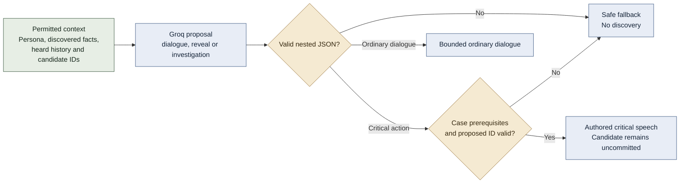
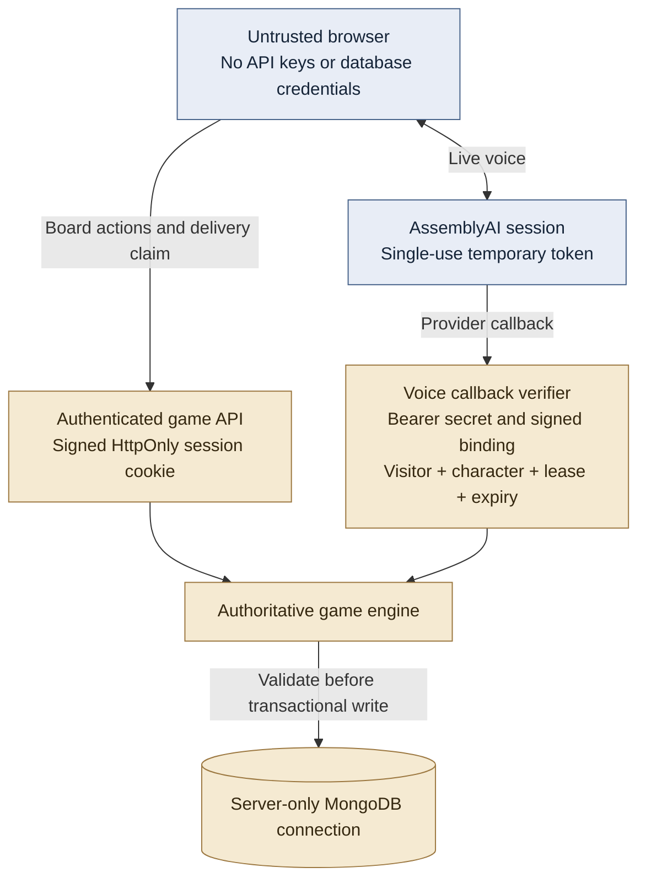

# Runtime and trust boundaries

## Responsibilities

| Component | Owns | Does not own |
| --- | --- | --- |
| React game and React Flow board | Case selection, portraits, discovered notes, local pin layout, interview and reconstruction UI | Canonical truth or evidence unlock rules |
| Browser voice client | Microphone consent, 24 kHz PCM streaming, local playback, measured input level, confirmed interruption flushing | Raw-audio retention or model credentials |
| HTTP/session layer | Signed cookie validation, request checks, same-origin writes, safe error responses | Case-specific deduction logic |
| Game service | Available actions, disclosure prerequisites, approved turn lifecycle, proof checks, resolution | Speech synthesis or model-driven authority |
| Dialogue adapter | Permitted character context, structured proposals, schema validation, critical response selection | A second model review for every reply |
| Voice service | Temporary provider tokens, per-character agents, signed callback binding, usage leases and cleanup | Shared dialogue across visitors |
| MongoDB repository | Immutable case versions, transactional snapshots/turns/events, bounded history, TTL indexes | Presentation coordinates or raw audio |
| Detective partner | Case-specific directions and available investigative leads | Hidden solution access or automatic deduction for the player |

## AI proposal and approval

The model's schema contains `type`, `dialogue.text`, `reveal.id`, `reveal.level`, nested `reveal.condition`, and `investigation.id`. `condition_reached` is a proposal field, not an authorization signal. The game service independently checks the published rule. Locked revelation text and the canonical solution are excluded from ordinary model context.

Ordinary conversation relies on bounded context and prompt constraints. That reduces invention risk but does not prove every generated sentence is consistent. Critical revelations use backend rules and authored wording. Broader prompt-injection and free-form consistency testing remain necessary.

## Security boundaries

- Cookies use `HttpOnly`, `SameSite=Lax`, and `Secure` on the production path. Expiry is checked by the server.
- Voice callbacks require a bearer secret plus an HMAC-signed visitor/character/lease binding. The active lease and selected character must match.
- The server rejects disallowed cross-origin writes, unavailable actions, malformed proposals, and expired sessions.
- The client receives allowlisted game projections. It has no direct Atlas access and does not import private case packs into the UI.
- Secrets stay in environment configuration without frontend `VITE_` prefixes. Error logging avoids request bodies and credentials.

The public source repository contains authored answers for reproducibility. These boundaries protect the runtime progression path; they are not anti-cheat protection against someone reading the source. Browser delivery acknowledgement is also a client assertion, not cryptographic proof that a human listened.

## Source map

[`server/app.mjs`](../server/app.mjs), [`server/game.mjs`](../server/game.mjs), [`server/dialogue.mjs`](../server/dialogue.mjs), [`server/voice.mjs`](../server/voice.mjs), [`server/security.mjs`](../server/security.mjs), [`src/lib/voice-client.js`](../src/lib/voice-client.js).
