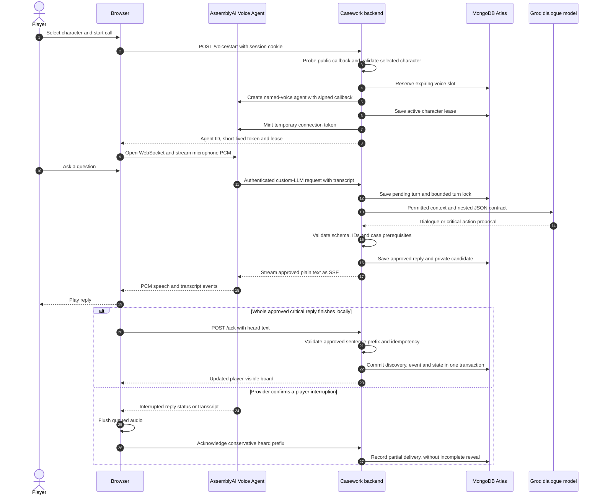
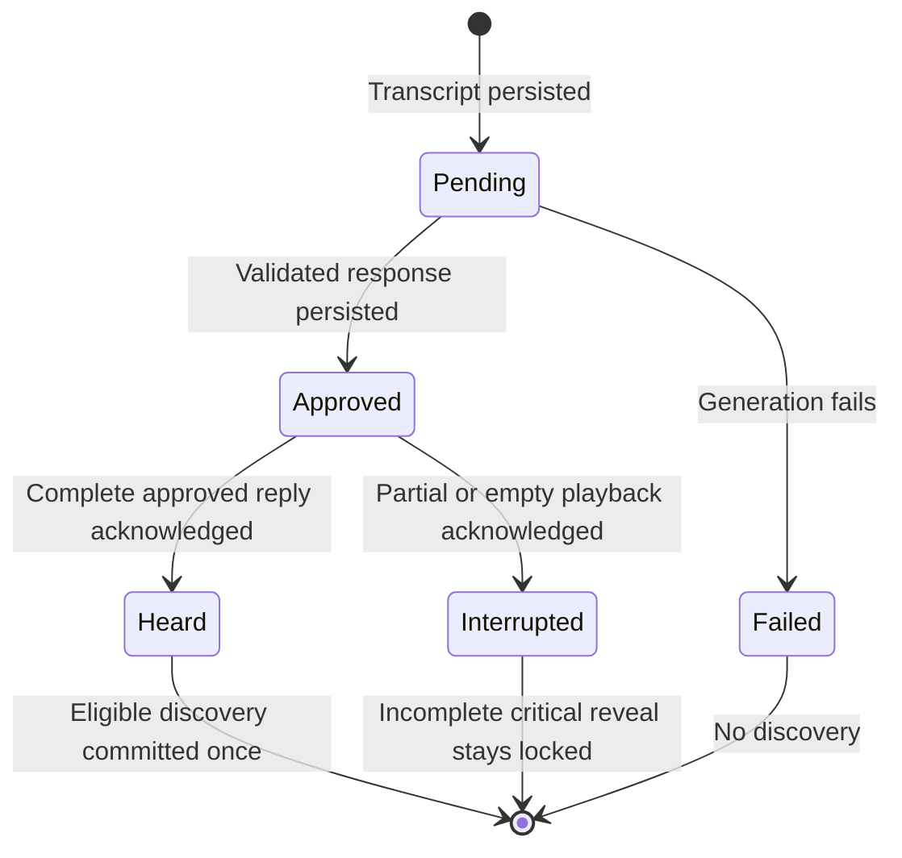

# Voice and discovery flow

## One spoken turn

The transcript write happens **before** the model call. The approved reply write happens **before** speech. The discovery write happens **after** validated delivery. Network/model calls run outside database transactions.

## Turn lifecycle

The current implementation deliberately requires the **whole short critical reply** before committing its revelation. Sentence-prefix accounting preserves partial transcript text, but finer-grained clue-bearing sentence commitment is future work.

## Interruption and failure behavior

`input.speech.started` alone does not discard an active reply: an acknowledgement such as “uh-huh” may be a back-channel. The client flushes on a confirmed interrupted `reply.done` or `transcript.agent`, handles either order, and ignores late audio for that reply. This follows [AssemblyAI's semantic interruption contract](https://www.assemblyai.com/docs/voice-agents/voice-agent-api/turn-detection-and-interruptions).

| Condition | Client behavior |
| --- | --- |
| Socket session never becomes ready | Visible error after 20 seconds |
| Speech ends, but no reply starts | Pending-response state and a 30-second bound |
| Reply starts without playable audio | Visible error after 30 seconds |
| Microphone capture stops | Visible error after more than six seconds without capture frames |
| Track ends, context pauses, or socket closes unexpectedly | Actionable error and call cleanup |
| Text arrives without audio | No spoken-delivery acknowledgement |
| Call ends during queued playback | No acknowledgement of the unfinished reply |

The microphone meter measures local capture amplitude, not provider recognition. It updates at most five times per second and retains no recording. The evidence graph is memoized, so audio/caption updates do not rebuild board nodes. A new discovery revision still updates the board.

Named voices are fixed for each provider session. Switching contacts ends the current call and creates a new session for the chosen character. No microphone starts merely because a portrait is selected.
